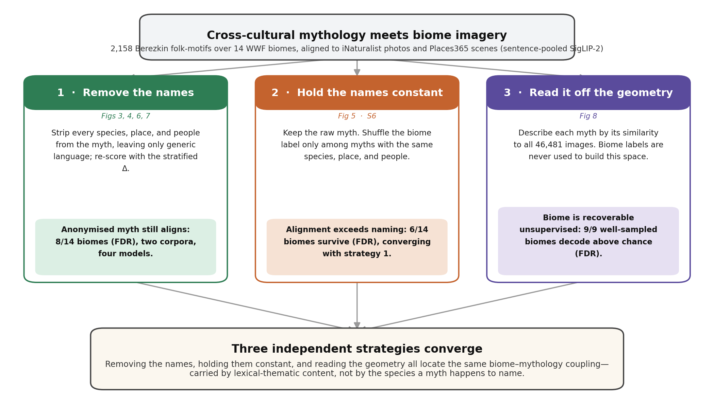
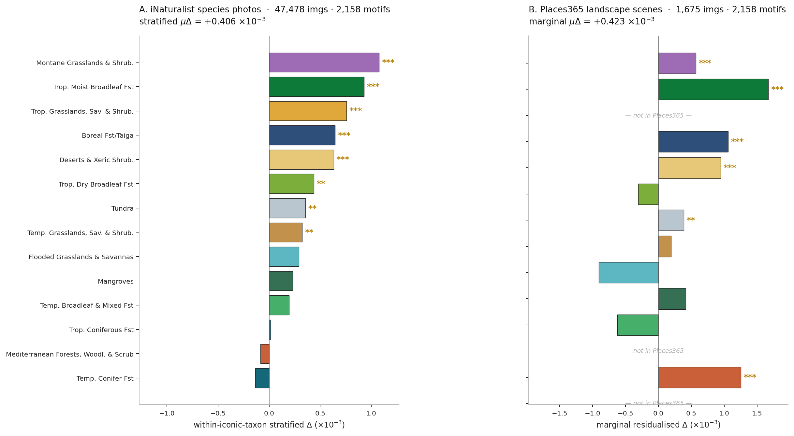
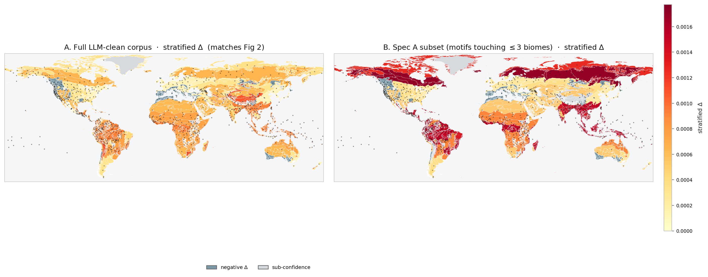
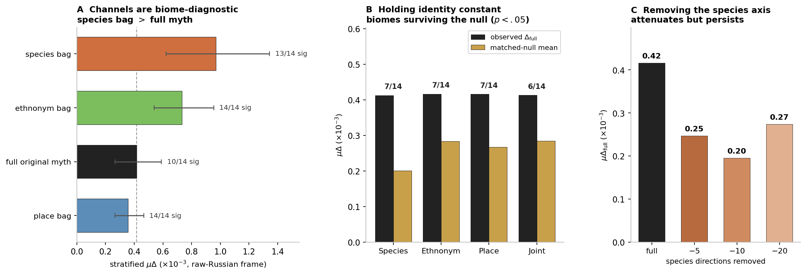
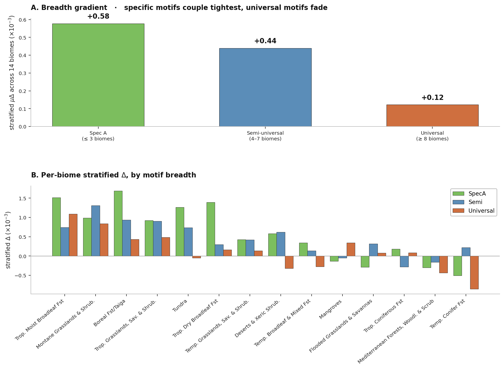
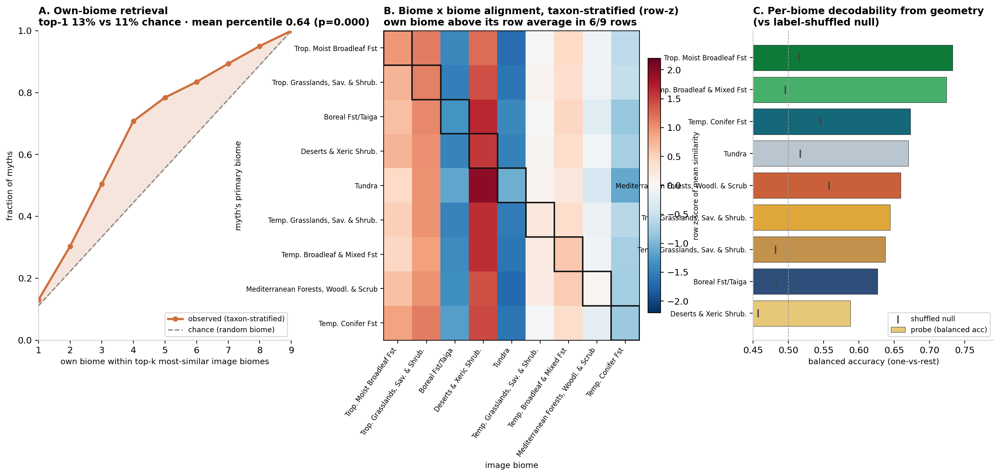

# The Imagination of Nature

### Mythology as the Cultural Recording Layer of Perceptual Coupling

A study testing whether the mythologies of cultures inhabiting different
biomes carry a recoverable visual signature of those biomes — a signature
that holds when the species, places, and peoples a myth names are controlled
for, shown by **three independent methods that converge on the same biomes**.

The pattern is consistent with perceptual coupling at the lexical-thematic
level: the trace a mythology carries of its biome is not a catalogue of
names but the schemas of attention, activity, and form that a place makes
available to imagination.

---

## What the study finds

Each motif in Berezkin's catalogue of **958 cross-cultural folk traditions**
(geocoded to the 14 WWF terrestrial biomes) is embedded with sentence-pooled
SigLIP-2 and aligned to images of its biome, on two independent visual
corpora — **46,481 iNaturalist species photographs** and **1,655 Places365
landscape scenes**. A tradition's mythology aligns above chance with its own
biome's imagery, and **this alignment is not reducible to the species,
places, or peoples a myth happens to name**. Three independent controls,
with non-overlapping assumptions, converge on the same biomes:

1. **Remove the names.** After an LLM pipeline strips species, place,
   ethnonym, and biome-word vocabulary from the text, the within-iconic-taxon
   stratified Δ is positive in **8 of 14 biomes** at Benjamini–Hochberg FDR,
   on both image corpora and across four vision–language models (SigLIP-2,
   M-CLIP, OpenCLIP-LAION-2B, OpenCLIP-OpenAI).
2. **Hold the names constant.** On the *raw* myths, a matched-permutation
   null that shuffles biome only among motifs with the same
   species/place/ethnonym identity content leaves **6 of 14 biomes**
   significant (FDR), converging with strategy 1 (Spearman ρ = 0.75 on the
   per-biome Δ).
3. **Read it off the geometry.** Describing each myth by its similarity
   profile across all images, and never using biome labels to build the
   space, biome is recoverable unsupervised: own biome ranks in the **64th
   percentile** (iNaturalist) and **61st** (Places365), and **9/9 and 7/7
   well-sampled biomes decode above a label-shuffled null** at FDR.

The alignment **decays monotonically with motif breadth** — strongest where
the mythology is biome-specific, fading toward zero where it has propagated
across most of the world. This breadth gradient is the load-bearing
signature: biome-specific motifs stabilised in encounter with a particular
ecology and carry that encounter forward in their narrative substance, while
universal motifs propagated by detaching from any single biome — a gradient
more naturally expected under a coupling reading (in the lineage from
Schelling and Bateson through contemporary 4E cognitive science) than under
a projection account.

Two further controls bound where the signal lives:

- A **class-word collapse** — reducing every animal-kingdom word in the
  cleaned text to `animal` and every plant word to `plant` — attenuates the
  per-taxon alignment for mammals, reptiles, and amphibians (whose
  mythological presence is built mostly from naming) but leaves plants,
  fungi, birds, and insects largely intact (built more from activities and
  contexts than from names).
- A **within-Glottolog-macroarea biome-swap null**, holding cultural region
  constant while shuffling biome assignment, leaves **6 of 14 biomes** above
  the 95th percentile of the swap distribution. Cultural autocorrelation
  contributes to the alignment but does not exhaust it.

---

## Headline figures

| | |
|---|---|
| **Fig 1 — Roadmap.** The three independent strategies that locate the biome–mythology coupling and converge on the same biomes. |  |
| **Fig 3 — Two-corpus alignment.** Biome × mythology alignment on iNaturalist (stratified Δ) and Places365 (marginal Δ). |  |
| **Fig 4 — Geography.** Per-biome stratified Δ projected onto a world map: full corpus (A) and biome-specific Spec A subset (B). |  |
| **Fig 5 — Hold the names constant.** The alignment on the raw, un-anonymised myths is not reducible to identity naming: a matched-permutation null (6/14 survive the joint identity control) and a species-subspace projection. |  |
| **Fig 6 — Breadth gradient.** Stratified μΔ falls from +0.58 ×10⁻³ in biome-specific motifs to +0.12 ×10⁻³ in universals. |  |
| **Figs 8–9 — Read it off the geometry.** Biome recovered from the unsupervised myth × image affinity geometry, without biome labels, on iNaturalist (Fig 8) and Places365 scenes (Fig 9). |  |

---

## Setup

Python dependencies are managed with [uv](https://docs.astral.sh/uv/):

```bash
uv sync                 # .venv with the analysis + figure dependencies
uv sync --extra embed   # adds torch / transformers / open-clip-torch (only needed to
                        #   re-embed; for CUDA add --index https://download.pytorch.org/whl/cu121)
```

Run any script inside that environment with `uv run python <script>` (as below).

The PDF is built with **tectonic**, a standalone binary rather than a Python
package, so install it separately — e.g. `scoop install tectonic`,
`cargo install tectonic`, or the prebuilt binary from the
[tectonic site](https://tectonic-typesetting.github.io/en-US/install.html).

---

## How to reproduce

The full pipeline is documented in [`REPRODUCE.md`](REPRODUCE.md). The
minimum end-to-end reproduction from the shipped cleaned text and image
embeddings:

```bash
# Embed the motif text (LLM-clean, sentence-pooled) + class-word-collapse re-embed
uv run python src/embedding/sentence_pooled_siglip.py
uv run python src/embedding/class_word_collapse.py

# Strategy 1 — remove the names: stratified Δ + controls
uv run python src/analysis/recompute_all.py
uv run python src/analysis/per_taxon.py
uv run python src/analysis/stratified_baselines.py
uv run python src/analysis/word_shuffle.py
uv run python src/analysis/crossmodel.py
uv run python src/analysis/biome_tell.py
uv run python src/analysis/glottolog_swap.py

# Strategy 2 — hold the names constant: identity decomposition + matched-permutation null
uv run python src/analysis/ladder_embed.py             # needs _entity_extraction/ + GPU
uv run python src/analysis/ladder_stats_stratified.py
uv run python src/analysis/ladder_figure.py 0.416 0.247 0.195 0.274
uv run python src/analysis/matched_null_figures.py     # discrete matched null (S6 convergence)

# Strategy 3 — read it off the geometry: unsupervised biome recovery
uv run python src/analysis/myth_image_umap2.py
uv run python src/analysis/biome_recovery_figure.py            # iNaturalist
uv run python src/analysis/biome_recovery_places365.py         # Places365 scenes

# Figures
uv run python src/figures/fig_roadmap.py
uv run python src/figures/make_v3_figures.py
uv run python src/figures/taxon_combined.py
uv run python src/figures/taxon_facets.py
uv run python src/figures/fig3_nolll.py    # \
uv run python src/figures/fig5_nolll.py    #  } S6 two-method convergence figures
uv run python src/figures/fig6_nolll.py    # /

# Compile the PDF (paper.pdf is the canonical manuscript)
cd paper && tectonic paper.tex
```

To reproduce from scratch (no cleaned text, no embeddings), run the
acquisition scripts under `src/acquisition/` and the build-spine /
unified-manifest scripts under `src/pipeline/` first.

---

## Repository layout

```
pareidolia-in-nature/
├── README.md              ← you are here
├── REPRODUCE.md           ← step-by-step pipeline
│
├── paper/                 ← LaTeX manuscript (paper.tex / paper.pdf) + figures
├── dataset/               ← canonical data spine + embeddings + manifests
├── raw_downloads/         ← Berezkin HTML cache, WWF Ecoregions shapefile
│
├── src/                   ← all paper code, organised by pipeline phase
│   ├── acquisition/       ← Berezkin scraper, iNat / YFCC / Places365 downloaders, WWF join
│   ├── pipeline/          ← spine + unified image manifest construction
│   ├── embedding/         ← sentence-pooled SigLIP-2, cross-model, class-word collapse
│   ├── analysis/          ← Δ tests, matched-permutation null, breadth, per-taxon,
│   │                        biome-tell, Glottolog swap null, unsupervised geometry recovery
│   └── figures/           ← paper figure generators (roadmap, convergence figures, …)
│
├── motif_specificity_controls.py   ← shared utility modules at the project root,
├── make_phase2_figures.py          ←   imported by 30+ scripts under src/
├── specA_paper_runs.py             ←   under their original names, so the
├── make_effect_maps_v2.py          ←   import surface stays stable
│
└── _archive/              ← legacy / superseded scripts kept locally, .gitignored
```

The four shared utility modules live at the project root because they are
imported by 30+ scripts under `src/`. Each `src/` script begins with a small
`sys.path` bootstrap that inserts the project root onto the import path, so
`from motif_specificity_controls import ...` resolves unchanged.

---

## Heavy data and the .gitignore

The image-side embeddings (`dataset/imagery/embeddings/*.npy`), the iNat /
YFCC / Places365 image binaries, the Berezkin HTML cache, and the WWF
Ecoregions shapefile are not version-controlled. See `.gitignore` for the
precise exclusions. The canonical motif text
(`dataset/analysis/llm_rewrite_specA_gemini_pass2.csv`) and the tradition /
motif spine parquets (`dataset/mapping_v2/`) are tracked.

---

## Author

**Antoine Bellemare-Pepin** — Department of Psychology, Université de Montréal  
**Mar Estarellas** — Department of Psychiatry, McGill University

## Citation

> Bellemare-Pepin A, Estarellas M. *The Imagination of Nature:
> Mythology as the Cultural Recording Layer of Perceptual Coupling*.
> Preprint, 2026.

## Acknowledgement

This project uses Yu. E. Berezkin's *Analytical Catalogue of World
Mythology and Folklore* (ruthenia.ru), the WWF Terrestrial Ecoregions of
the World, iNaturalist Open Data, Places365, and the YFCC100M dataset.
